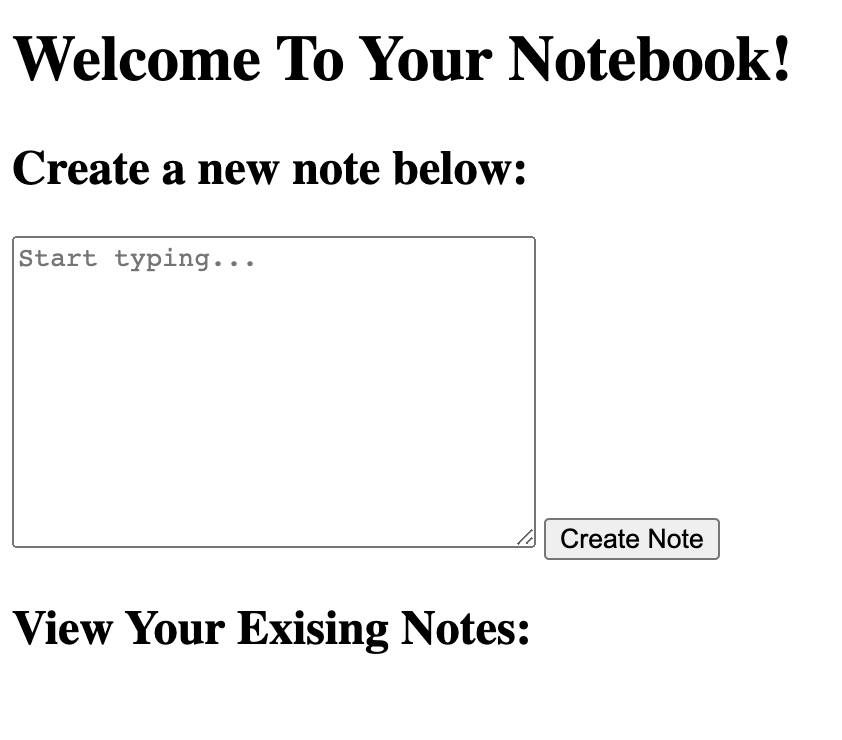
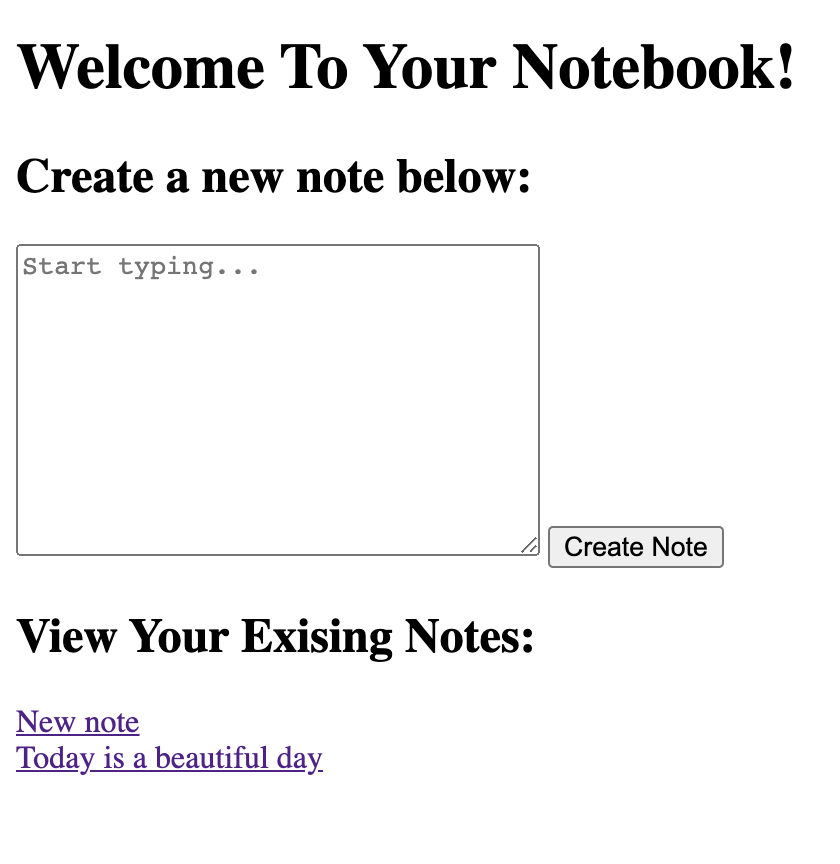
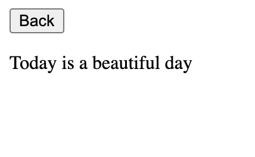

# Notes-app
A frontend single-page app where users can make notes. 

This has been built using only Vanilla Javascript.

## User stories ##

```
As a programmer
I can create a new note
So I can record something I need to remember

As a programmer
I can see a list of my notes, where each note is abbreviated to the first 20 characters
So I can find the one I want


As a programmer
I can see the full text of an individual note on its own page
So I can see all the information in the note

As a programmer
I can use shortcodes like `:fire:` that get converted into emojis like 🔥
So I can record notes with fun little pictures
```


## How to use the app ##

1. Clone this repo to your local computer

```
git clone https://github.com/lisabardelli/notes_app.git

```

Move to the repo

```
cd  notes_app

```

Run locally
```
open ./views/index.html 
```


## How to use the Testing Framework ##
1. Please clone the [testing framework](https://github.com/lisabardelli/team_clic_testing_framework.git) into the same parent directory as the main repository


```
git clone ttps://github.com/calavell/team_clic_testing_framework
```
2. In the index.html file, add the following code:

```
<script src="path_from_current_file_to_testing-framework.js"></script>
```
3. Please note the above script tag must be above the script tags for the test files
4. To run the tests, open the index.html file in your web browser and open the console to view test results.

## Add a note

## View all notes

## Click on single note

